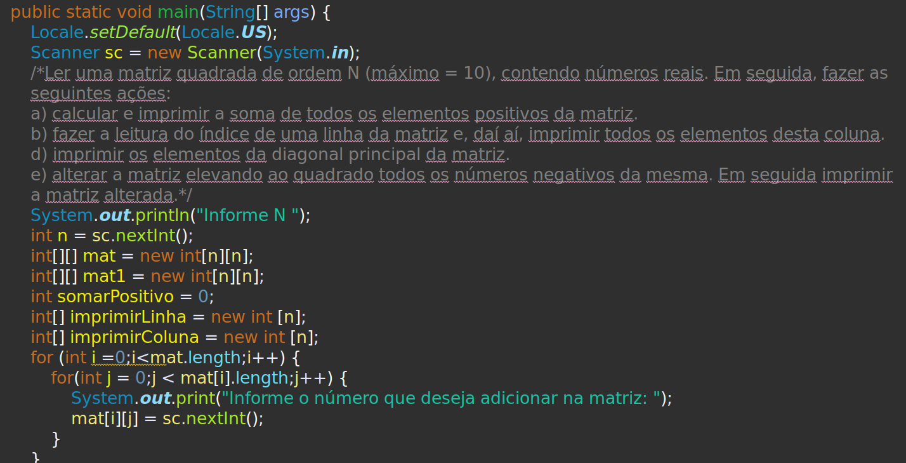
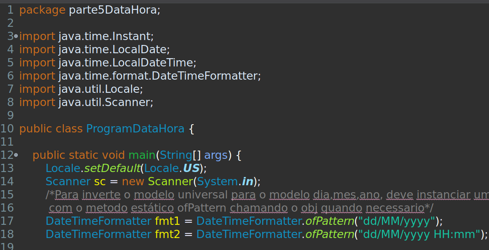
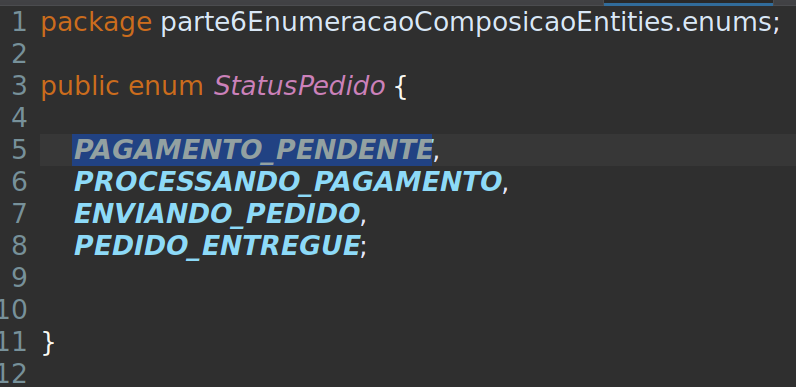
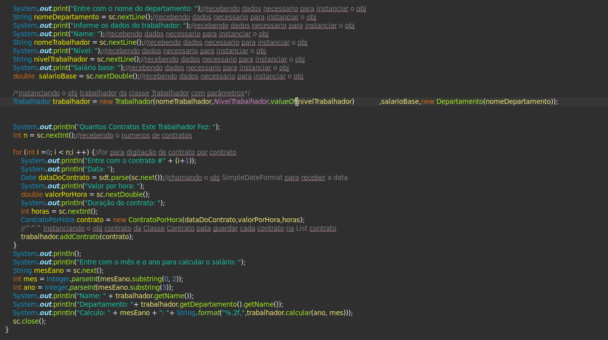
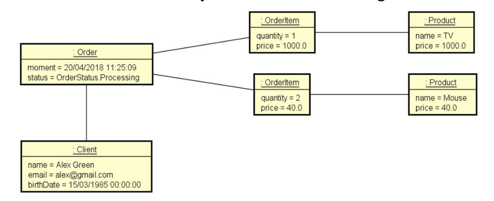

# CursoCompletoJava
Atualmente, estou dedicando tempo e esforço para aprimorar minhas habilidades em programação através de um curso completo de Java. Nesse curso, estou aprendendo os fundamentos e princípios da programação orientada a objetos (OOP), utilizando a linguagem Java como base.

Comecei do básico, aprendendo a sintaxe do Java, a manipulação de variáveis e as estruturas de controle. Conforme avanço, mergulho em conceitos mais complexos, como classes, objetos, herança, polimorfismo, encapsulamento e abstração.

Além disso, estou sendo apresentado a tópicos avançados, como interfaces, tratamento de exceções, coleções, generics e lambda expressions. Também estou explorando o Spring Boot, um framework popular para o desenvolvimento de aplicativos Java, o que me permite aprender sobre a persistência de dados.

Durante o curso, estou realizando exercícios práticos para aplicar os conceitos aprendidos. Esses exercícios são baseados em problemas do mundo real, o que me ajuda a entender como os conceitos da OOP são aplicados na prática.

Através desse curso, espero adquirir um sólido conhecimento em programação Java e aprofundar minhas habilidades em OOP. Dessa forma, estarei preparado para enfrentar desafios mais complexos no desenvolvimento de software e aplicar meus conhecimentos para criar aplicativos utilizando o Spring Boot.

```java
package parte1ClassesAtributosMetodosApplication;

import java.util.Locale;
import java.util.Scanner;

import parte1ClassesAtributosMetodosEntities.Employee;

public class ProgramEmployee {

	public static void main(String[] args) {
		Locale.setDefault(Locale.US);
		Scanner sc = new Scanner(System.in);
		/*Fazer um programa para ler os dados de um funcionário (nome, salário bruto, e imposto).
		 Em seguida, mostrar os dados do funcionário (nome e salário liquido).
		 Em seguida, aumentar o salário do funcionário com base em uma porcentagem dada (somente 
		 o saalário bruto é afetado pela porcentagem) e mostrar novamente os dados do funcionário. Use 
		 a classe projetada no PDF.*/
		
		Employee funcionario01 = new Employee();
		
		System.out.println("Informe o nome: ");
		funcionario01.nome = sc.nextLine();
		System.out.println("Informe o Salário Bruto");
		funcionario01.grossSalary = sc.nextDouble();
		System.out.println("Informe o imposto a ser deduzido");
		funcionario01.tax = sc.nextDouble();
		
		System.out.println("Salário liquido: "+String.format("%.2f%n", funcionario01.netSalary()));
		
		System.out.println("Informe porcentagem de aumento:");
		double percentage = sc.nextDouble();
		funcionario01.increaseSalary(percentage);
		
		System.out.println(funcionario01.netSalary());		
		
		sc.close();

	}

}
 
```
---

# PARTE 2: Membros estáticos

Nesse exercício sobre membros estáticos, foi evidente a importância da utilização da palavra-chave "static". Essa importação se faz necessária, pois ela permite que os métodos ou atributos possam ser acessados sem a necessidade de se instanciar um objeto. Além disso, foi possível praticar o conceito de criação de constantes utilizando métodos e atributos estáticos.

Outro aspecto abordado foi o uso do método "System.out". Quando esse método é seguido pelo "print", o resultado é exibido em branco no terminal. Por outro lado, ao utilizar "System.err" seguido de "print", o resultado é exibido em vermelho, proporcionando uma forma visual de diferenciar informações importantes ou de erro durante a execução do programa.


```java
package parte2MembrosStaticApplication;

import java.util.Locale;
import java.util.Scanner;
import parte2MembrosStaticEntities.CurrencyConverter;
public class ProgramCambio {
	
	public static void main(String[] args) {
		Locale.setDefault(Locale.US);
		Scanner sc = new Scanner(System.in);
		/*Faça um programa para ler a cotação do dólar, e depois um valor em dólares a ser
           comprado por uma pessoa em reais. Informar quantos reais a pessoa vai pagar pelos 
           dólares, considerando ainda que a pessoa terá que pagar 6% de IOF sobre o valor em 
           dólar. Criar uma classe CurrencyConverter para ser responsável pelos cálculos.*/
		
		System.out.println("Qual o Valor do Dolar? ");
		CurrencyConverter.dolar = sc.nextDouble();
		System.out.println("Qual a quantidade de Dólares serão comprados?");
		CurrencyConverter.qtsDolar = sc.nextDouble();		
		System.err.println("Valor a ser pago em reais = "
		+String.format("%.2f",CurrencyConverter.Converte()));		
		sc.close();
	}
}
package parte2MembrosStaticEntities;

public class CurrencyConverter {//Conversor de moeda
	
	public static double dolar;
	public static double qtsDolar;
	public static final double IOF = 0.06;

	public static double Converte() {
		return (((qtsDolar  * dolar) * IOF )+ qtsDolar * dolar);
	}

}
 
```
---
# Parte3 Construtores, this, sobrecarga,encapsulamento

Realizei um exercício com o objetivo de aprofundar minha compreensão sobre a importância do encapsulamento, além de reforçar meus conhecimentos sobre construtores, métodos getters e setters. Nesse exercício, criei uma classe com atributos privados e utilizei construtores para inicializá-los corretamente. Em seguida, implementei métodos getters e setters para acessar e modificar esses atributos de maneira controlada.

Para expandir meu aprendizado, introduzi uma estrutura condicional switch no programa. Essa estrutura me permitiu criar diferentes casos de uso para os métodos getters e setters, o que me ajudou a compreender melhor como essas funções podem ser úteis em diferentes situações.

Esse exercício foi extremamente valioso, pois me permitiu consolidar meu conhecimento sobre encapsulamento e demonstrou a importância de utilizar construtores, getters e setters de forma adequada. Além disso, ao introduzir o switch, pude ampliar minha compreensão sobre estruturas condicionais e como elas podem ser combinadas com os princípios de encapsulamento para criar código mais eficiente e modular.

```java
package parte3ConstrutoresThisSobrecargaEncapsulamentoEntities;

public class Conta {
	
	private String name;
	private Integer numeroConta;
	private double saldo;
	public Conta(String name, Integer numeroConta, double saldo) {
		super();
		this.name = name;
		this.numeroConta = numeroConta;
		deposito(saldo);//importante conceito que protege o programa de mudanças futuras
	}
	public Conta(String name, Integer numeroConta) {
		super();
		this.name = name;
		this.numeroConta = numeroConta;
	}
	public String getName() {
		return name;
	}
	public void setName(String name) {
		this.name = name;
	}
	public Integer getNumeroConta() {
		return numeroConta;
	}
	public double getSaldo() {
		return saldo;
	}
	@Override
	public String toString() {
		return name
				+ "\nnumeroConta= " + numeroConta 		
				+ "\nsaldo= " + saldo;
	}
	public double deposito(double deposito) {
		return saldo += deposito;
	}
	public double saque(double saque) {
		return saldo -= (saque +  5.00);
	}
	
	}

```
---
# Parte4 Mémoria,Vetores,Matrizes e Listas


Neste primeiro tópico da Parte 4, foram realizados doze exercícios com foco em solidificar o conhecimento sobre a criação de vetores e toda a lógica por trás dessa estrutura de repetição. Agora, avançaremos para a próxima fase, na qual estudaremos matrizes.

```java
/* For com estrutura condicional if para descobrir em qual percentual o dados
   recebidos se encaixam, conforme o solicitado pelo exercicio*/ 
for (int i = 0; i < nome.length; i++) {
	          
	if (precoVenda[i] < precoCompra[i] + (precoCompra[i] * 0.10)) {
	menosDe10++;
		} else if (precoVenda[i] >= precoCompra[i] + (precoCompra[i] * 0.10)
		&& precoVenda[i] <= precoCompra[i] + (precoCompra[i] * 0.20)) {
				entre10e20++;
		} else if (precoVenda[i] > (precoCompra[i] + (precoCompra[i] * 0.20))) {
				maiorQue20++;
	    }
	}
```
Ao estudar matrizes em Java, aprendi a realizar diversas operações, como adição, subtração e multiplicação entre matrizes. Também descobri como realizar a transposição de uma matriz, trocando as linhas pelas colunas, e como calcular a matriz inversa utilizando métodos matemáticos adequados. Além disso, Java oferece recursos para percorrer e manipular os elementos de uma matriz, facilitando a implementação de algoritmos que envolvam processamento de dados matriciais.

Através do estudo de matrizes em Java, pude aprimorar minhas habilidades de programação e compreender melhor a aplicação desses conceitos em soluções computacionais




Também tive uma breve introdução em collections

---
# Parte5  Data e Hora (ISO 8601)



Representação de datas e horas:

Para criar um objeto LocalDate, você pode usar os métodos estáticos of, parse ou now.
Para criar um objeto LocalTime, você também pode usar os métodos estáticos of, parse ou now.
Para criar um objeto LocalDateTime, você pode combinar objetos LocalDate e LocalTime.
Para criar um objeto ZonedDateTime, você pode usar LocalDateTime juntamente com um objeto ZoneId.
Para criar um objeto Instant, você pode usar o método estático now.
Manipulação de datas e horas:

Você pode usar vários métodos para manipular objetos de data e hora, como plus, minus, with, get, isBefore, isAfter, etc.
Esses métodos retornam um novo objeto, pois os objetos LocalDate, LocalTime e LocalDateTime são imutáveis.
Formatação e análise de strings:

A classe DateTimeFormatter permite formatar objetos de data e hora em strings legíveis e analisar strings em objetos de data e hora.
Você pode usar um DateTimeFormatter predefinido ou criar um formato personalizado.
Cálculos com períodos e durações:

A classe Period é usada para representar um período de tempo em termos de anos, meses e dias.
A classe Duration é usada para representar uma duração em termos de horas, minutos, segundos e nanossegundos.
---
# Parte6  Enumeração e Composição.

Enumeração: A enumeração é um tipo de dado utilizado para armazenar um conjunto de valores constantes. É uma forma de definir um novo tipo de dados que consiste em um conjunto fixo de constantes nomeadas. Cada constante na enumeração representa um valor específico dentro do conjunto.

Composição: A composição refere-se à relação entre classes, onde uma classe é composta por outras classes. É uma forma de organizar e estruturar objetos complexos, combinando vários objetos menores em uma única entidade.



Na parte 6 do nosso estudo, exploramos a fascinante área da programação, onde mergulhamos em três programas distintos. Cada um desses programas foi cuidadosamente projetado para atender a diferentes necessidades e desafios.

Ao desenvolver esses programas, tivemos a oportunidade de trabalhar com um total de nove entidades distintas. Cada entidade representava um componente essencial dentro do contexto dos programas, contribuindo para a sua funcionalidade e execução correta.

Além disso, buscamos aprimorar nossos conhecimentos ao criar dois enums. Esses enums foram utilizados para armazenar conjuntos específicos de valores constantes, fornecendo uma forma prática e organizada de representar e manipular esses conjuntos dentro dos programas.



Na foto acima, podemos observar um programa que realiza o cálculo de contratos para um trabalhador. O programa segue os seguintes passos: primeiro, é solicitado o nome do departamento ao qual o trabalhador pertence. Em seguida, são requisitados os dados do trabalhador, como nome, nível e salário base.

Utilizando a enumeração, podemos converter a string recebida para o tipo enum adequado por meio do método valueOf. Dessa forma, podemos criar uma instância do objeto trabalhador, incluindo a instância do departamento ao qual ele pertence. O departamento, por sua vez, possui apenas um atributo, que é armazenado durante a instanciação.


Na foto acima, podemos ver que aplicamos a estrutura de repetição for para receber o número de contratos e guardar seus dados na lista contrato. Essa lista foi criada e instanciada na classe Trabalhador.

Utilizando o for, percorremos um determinado intervalo de vezes, definido pelo número de contratos informados. Durante cada iteração, solicitamos os dados específicos de cada contrato, como data, valor e descrição. Esses dados são então armazenados em um objeto contrato, que é adicionado à lista contrato.

Dessa forma, conseguimos registrar e manter um histórico dos contratos realizados pelo trabalhador, facilitando a análise e manipulação dessas informações posteriormente.

A utilização do for em conjunto com a lista contrato permite uma maneira eficiente de coletar e organizar os dados dos contratos, proporcionando um melhor controle e acompanhamento das atividades do trabalhador.
System.out.println();


Por fim, utilizamos o método substring para obter o mês e o ano a partir da data dos contratos, visando uma conferência mais específica. Além disso, chamamos o método calcular, que também merece destaque pelo uso da classe Calendar.
```java
	System.out.println();
		System.out.println("Entre com o mês e o ano para calcular o salário: ");
		String mesEano = sc.next();
		int mes = Integer.parseInt(mesEano.substring(0, 2));
		int ano = Integer.parseInt(mesEano.substring(3));
		System.out.println("Name: " + trabalhador.getName());
		System.out.println("Departamento: "+ trabalhador.getDepartamento().getName());
		System.out.println("Calculo: " + mesEano + ": "+ String.format("%.2f,",trabalhador.calcular(ano, mes)));
		sc.close();
```

Em seguida, chamamos o método calcular, para realiza o cálculo ou processamento com base nas informações dos contratos. É interessante mencionar que esse método utiliza a classe Calendar, que oferece uma ampla gama de recursos para lidar com datas, como manipulação, formatação e cálculos avançados.

O uso da classe Calendar adiciona uma camada de funcionalidade e precisão ao programa, permitindo que as datas sejam tratadas de forma adequada e eficiente.

Em resumo, o uso do substring para obter o mês e o ano, juntamente com a utilização da classe Calendar, demonstra uma abordagem detalhada e cuidadosa na manipulação e processamento de dados relacionados aos contratos do trabalhador.


```java
public double calcular(int ano,int mes) {
		double soma = salarioBase;
		Calendar cal = Calendar.getInstance();//CLASSE CALENDAR 
		
		for(ContratoPorHora c : contratos) {
			cal.setTime(c.getData());
			int cAno = cal.get(Calendar.YEAR);
			int cMes = 1 + cal.get(Calendar.MONTH);
			if (ano == cAno && mes == cMes) {
				soma+= c.valorTotal();
			}
		}
		return soma;
	}
	
```


O StringBuilder é uma classe do Java que nos permite construir e manipular strings de forma eficiente, especialmente quando precisamos realizar várias operações de concatenação ou modificação em uma mesma string.

No contexto do programa que recebe os pedidos de um cliente , o StringBuilder pode ser usado para criar uma representação formatada dos itens do pedido, consolidando todas as informações relevantes em uma única string. Dessa forma, podemos exibir ou armazenar os contratos de forma mais legível e organizada.

O StringBuilder oferece métodos para adicionar, substituir ou remover caracteres em uma string sem a necessidade de criar objetos adicionais a cada operação. Isso resulta em melhor desempenho e consumo de memória reduzido.

Portanto, ao utilizar o StringBuilder em nosso programa, garantimos uma manipulação mais eficiente e otimizada das strings relacionadas aos contratos, contribuindo para um código mais limpo e performático.
```java
@Override
	public String toString() {
		StringBuilder sb = new StringBuilder();
		sb.append("Momento do Pedido: ");
		sb.append(sdf.format(momento) + "\n");
		sb.append("Order status: ");
		sb.append(status + "\n");
		sb.append("Cliente: ");
		sb.append(cliente + "\n");
		sb.append("Itens do pedido :\n");
		for (ItemDoPedido item : itens) {
			sb.append(item + "\n");
		}
		sb.append("Preço Total : $");
		sb.append(String.format("%.2f", total()));
		return sb.toString();
	}

	
```
---

# Parte7  Herança e Polimorfismo.

Herança:
A herança é um conceito fundamental na programação orientada a objetos, e Java suporta esse conceito através das classes. Em Java, você pode criar novas classes baseadas em classes existentes, chamadas de classes derivadas ou subclasse. A classe derivada herda características, métodos e campos da classe base, chamada de superclasse. A herança permite reutilizar o código existente e estabelecer relações hierárquicas entre classes. Para criar uma classe derivada, você usa a palavra-chave extends. 
```java

public class Circulo extends Formas{
	
	private Double raio;
	
	public Circulo() {
		super();
	}
	
	public Circulo(Cor cor, Double raio) {
		super(cor);
		this.raio = raio;
	}
	
```
Polimorfismo:
Polimorfismo é outro conceito importante da programação orientada a objetos. Em Java, o polimorfismo permite que um objeto seja tratado de várias maneiras, dependendo do contexto em que é usado. Em outras palavras, um objeto pode assumir várias formas. O polimorfismo é alcançado através de dois mecanismos: sobrescrita de métodos e ligação dinâmica. A sobrescrita de métodos ocorre quando uma classe derivada fornece sua própria implementação de um método já definido na superclasse. A ligação dinâmica ocorre em tempo de execução, onde o método correto é chamado com base no tipo real do objeto.


```java

if(ch == 's') {
				System.out.print("Valor do Adicional:  ");
				Double adicionalTercerizacao = sc.nextDouble();
				list.add(new EmpregadoTercerizado(nome, horas, valorHora, adicionalTercerizacao));
			}else {
				list.add(new Empregado(nome, horas, valorHora));
			 }
		}
		
```
Agradecimentos Finais e Resumo.

Durante o curso, mergulhei nos fundamentos da programação orientada a objetos (OOP) utilizando a linguagem Java como base. Comecei aprendendo a sintaxe básica, manipulação de variáveis e estruturas de controle. À medida que avançávamos, exploramos conceitos mais complexos, como classes, objetos, herança, polimorfismo, encapsulamento e abstração.

Uma das partes fundamentais do curso foi a compreensão dos membros estáticos e seu uso adequado. A palavra-chave "static" desempenhou um papel crucial ao permitir o acesso a métodos e atributos sem a necessidade de instanciar objetos. Também aprendemos a utilizar os métodos "System.out" e "System.err" para exibir informações no terminal, diferenciando-as visualmente.

Outro tópico abordado foi o uso de construtores, as palavras-chave "this" e "super" para referenciar atributos e métodos, e a importância do encapsulamento. Aprendemos a criar classes com atributos privados e a utilizar métodos getters e setters para acessar e modificar esses atributos de forma controlada.

Na Parte 4 do curso, nos aprofundamos na criação e manipulação de vetores e avançamos para o estudo de matrizes. Compreendemos a importância da lógica por trás dessas estruturas e sua aplicação em problemas reais.

Exploramos também o tratamento de datas e horas utilizando o padrão ISO 8601. Aprendemos a criar objetos LocalDate, LocalTime, LocalDateTime, ZonedDateTime e Instant, bem como a manipular e formatar essas informações.

Na parte final do curso, abordamos a enumeração e a composição. A enumeração nos permitiu criar um conjunto de valores constantes e a composição nos ensinou a organizar objetos complexos, combinando várias classes em uma única entidade.

Por fim, estudamos a herança e o polimorfismo. A herança nos permitiu criar classes derivadas que herdam características da superclasse, possibilitando a reutilização de código. O polimorfismo, por sua vez, nos permitiu tratar objetos de várias formas, com base no contexto em que são utilizados.

Gostaríamos de agradecer ao professor Nélio Alves por seu comprometimento e dedicação em compartilhar seu conhecimento conosco. Sua didática clara e envolvente nos permitiu absorver os conceitos de forma eficaz, e sua disponibilidade em esclarecer dúvidas foi fundamental para o nosso crescimento.


